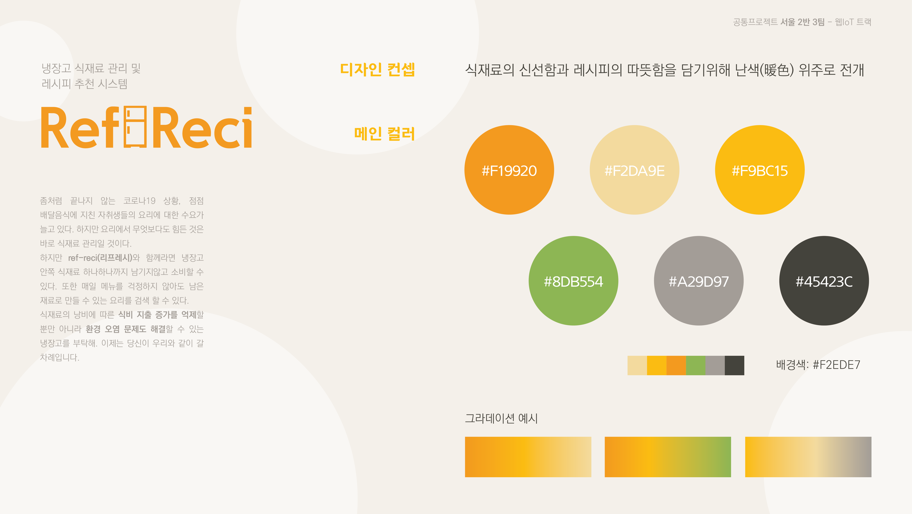
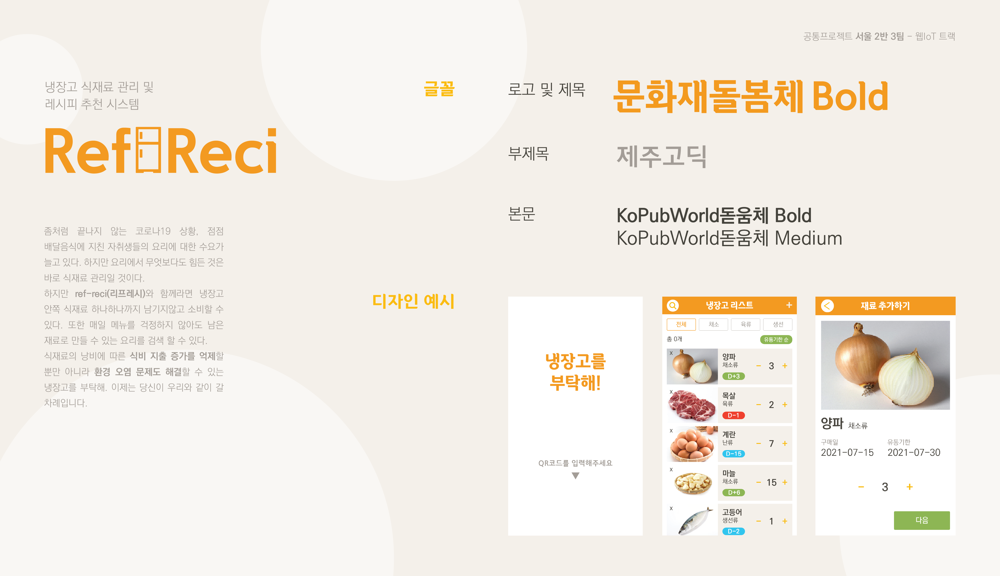

# Ref-Reci[리프레시] :rice:

## 목차

- [프로젝트 소개](#프로젝트-소개)    
- [프로젝트 명세](#프로젝트-명세)
  - [배포 환경](#배포-환경)
  - [개발 환경](#개발-환경)
  - [Design Resources](#design-resources)
  - [핵심 라이브러리](#핵심-라이브러리)
 

## 프로젝트 소개
식재료의 바코드를 인식하여 간단하게 리스트에 등록! 유통기한이 임박한 상품을 알려주니 더이상 낭비할 필요도 없죠! 게다가 레시피 추천까지?! 당신의 식재료를 끝까지 사용하도록 우리 ref-reci가 책임집니다.
 

## 프로젝트 명세
### 배포 환경
- __URL__ : AWS EC2에서 배포 예정
- __배포 여부__ : X
- __접속 가능__ : 개발중...
- __HTTPS 적용__ : X
- __PORT__ :
 

### 개발 환경
#### Front-end
- __Framework__ : React
- __지원 환경__ : Web / Mobile / Web App
- __담당자__ : 강리정, 강지은, 박지우
 

#### Back-end
- __Framework__ : express.js
- __Database__ : MySQL
- __담당자__ : 맹창영, 윤익선, 이지훈
 

#### Firmware
- __사용 장치__ : Raspberry Pi 4, Arduino Uno
- __Framework__ : PyQt
- __담당자__ : 강리정, 윤익선
 

#### Design
- __Framework 사용__ : X
- __Design Tool 사용__ : Adobe XD, Photoshop, Illustrator
- __담당자__ : 강리정, 강지은, 박지우
 

__자체 제작 산출물__
- 디자인 컨셉

- LOGO

 

### 핵심 라이브러리
<!-- - __COLOR THIEF__
  - __링크__ : https://lokeshdhakar.com/projects/color-thief/
  - __소개__ : 이미지에서 색상을 추출해주는 라이브러리
  - __사용 기능__ : 커버 사진에서 색상 추출 -> 배경 색상 변경
  - __담당자__ : 강지은, 강리정
 
- __Animate.css__
  - __링크__ : https://animate.style/
  - __소개__ : css 애니메이션 지원 라이브러리
  - __사용 기능__ : 메인 페이지 진입 시 애니메이션 사용
  - __담당자__ : 
 
-->

- **google cloud API**의 speech_to_text
  - __링크__ : https://cloud.google.com/
  - __소개__ : 음성인식 라이브러리
  - __사용 기능__ : 음성인식을 하여 text로 변환
  - __담당자__ : 윤익선
 

- __zbar__
  - __링크__ : http://zbar.sourceforge.net/
  - __소개__ : 바코드 인식 라이브러리
  - __사용 기능__ : 카메라를 이용한 바코드 인식 기능
  - __담당자__ : 윤익선
 
