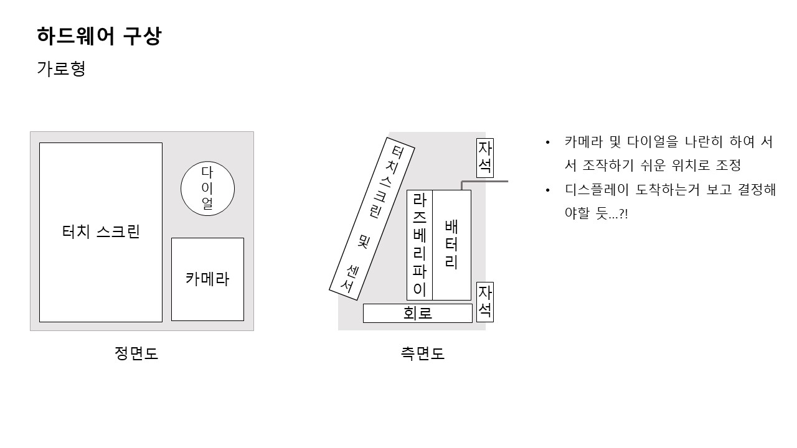
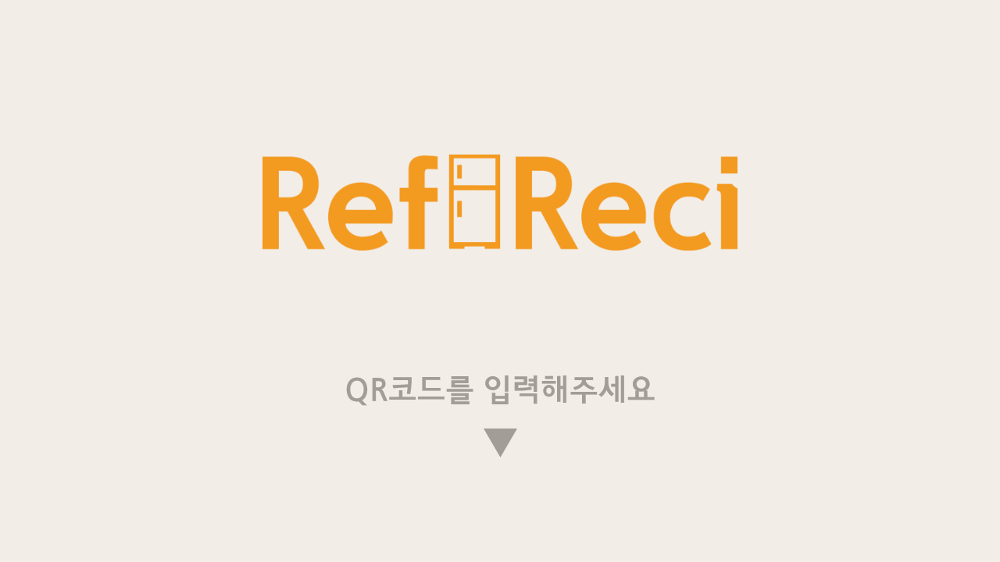
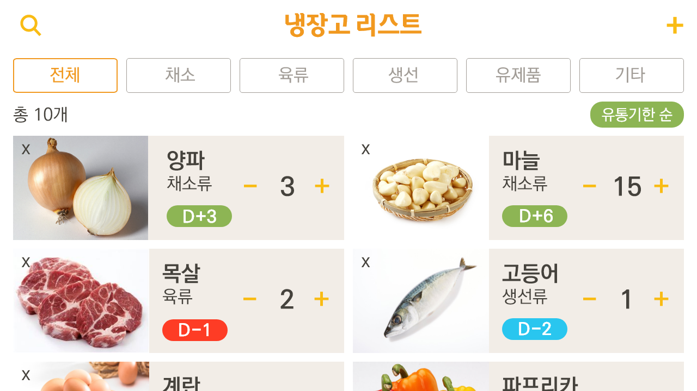
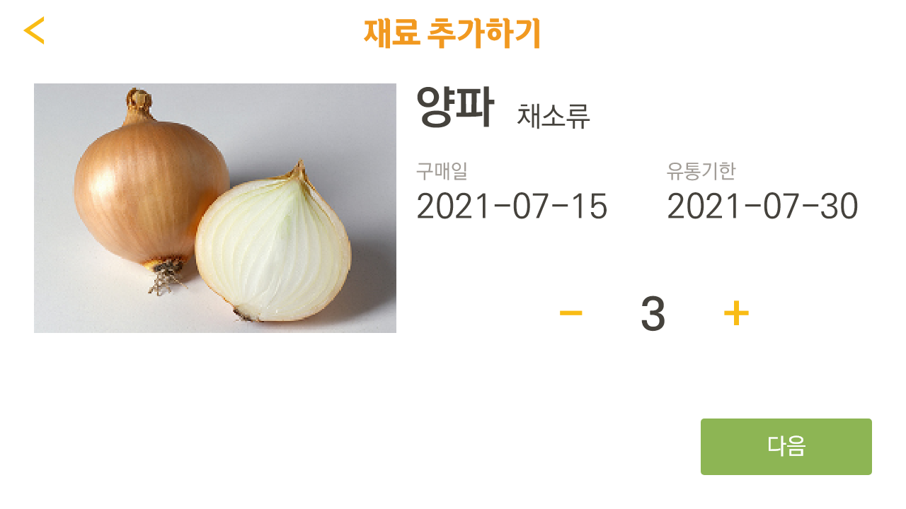

# Ref:Reci - Device
> Ref:Reci의 디바이스 측 소스코드

## 목차
- [디바이스 개요](#디바이스-개요)
- [디바이스 구조](#디바이스-구조)
- [GUI 설계](#GUI-설계)
- [폴더 구조](#폴더-구조)

## 디바이스 개요

## 디바이스 구조
### 가로형

## GUI 설계
### 자료 분석 및 와이어 프레임
첨부 자료 참고
 
[GUI 와이어 프레임](./참고자료/기존 어플리케이션 분석 및 GUI 흐름도.pdf)
 

### 디자인 시안

#### 가로형

 

## 폴더구조
**./ GUI** : .ui 파일 및 동작을 위한 main python 코드 
