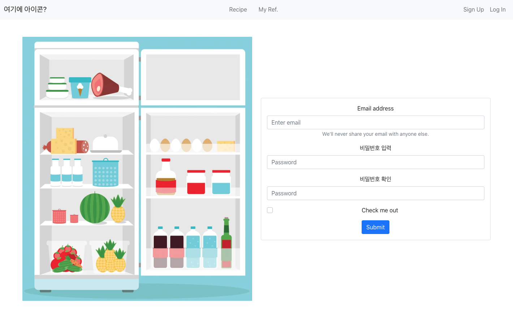

# [2일차] 회원가입, 로그인 페이지 UI 만들어보기


### 미리보기



(냉장고 이미지는 샘플입니다.)


### 개발환경

- React
- React-bootstrap ( + vanilla bootstrap )
- React-router-dom


### 코드

##### - App.js

```javascript
import './App.css';
import { Nav, Navbar, NavDropdown, Container } from 'react-bootstrap';
import React, {useState} from 'react';
import { 
  BrowserRouter as Router,
  Link, 
  Route, 
  Switch 
} from 'react-router-dom'
import Signup from './components/Signup';
import Login from './components/Login';
// import Content from '../src/components/content'


function App() {

  return (
    <div className="App">
      <Router>
      <Navbar bg="light" expand="sm">
        <Navbar.Brand href="#home" className="ms-3">여기에 아이콘?</Navbar.Brand>
        <Navbar.Toggle aria-controls="navbarScroll" />
        <Navbar.Collapse id="navbarScroll">
          <Nav
            className="mx-auto"
          >
            <Nav.Link className="mx-2" as={Link} to={'/recipe'}>Recipe</Nav.Link>
            <Nav.Link className="mx-2" as={Link} to={'/refrigerator'}>My Ref.</Nav.Link>
          </Nav>
          <Nav
            className="mx-3 my-lg-0"
          >
            <Nav.Link as={Link} to={'/signup'}>Sign Up</Nav.Link>
            <Nav.Link as={Link} to={'/login'}>Log In</Nav.Link>
          </Nav>
        </Navbar.Collapse>
      </Navbar>
      <Switch>
        <Route exact path="/signup">
          <Signup />
        </Route>
        <Route exact path="/login">
          <Login />
        </Route>
      </Switch>
      </Router>
    </div>
  );
}

export default App;

```


##### - Signup.js

```javascript
import React, {useState} from 'react';
import { Form, Button, Container, Card, Row, Col, Image } from 'react-bootstrap';

function Signup(props) {
  return (
    <Container className="themed-container my-5" fluid="lg">
      <Row
        className="justify-content-center align-items-center"
      >
        <Col md={6}>
          <Image src="https://secure.img1-fg.wfcdn.com/im/56785678/resize-w1300%5Ecompr-r85/3588/35882882/default_name.jpg" fluid />
        </Col>
        <Col md={6}>
          <Card>
            <Card.Body>
              <Form>
                <Form.Group className="mb-3" controlId="formBasicEmail">
                  <Form.Label>Email address</Form.Label>
                  <Form.Control type="email" placeholder="Enter email" />
                  <Form.Text className="text-muted">
                    We'll never share your email with anyone else.
                  </Form.Text>
                </Form.Group>
                <Form.Group className="mb-3" controlId="formBasicPassword">
                  <Form.Label>비밀번호 입력</Form.Label>
                  <Form.Control type="password" placeholder="Password" />
                </Form.Group>
                <Form.Group className="mb-3" controlId="formBasicPassword">
                  <Form.Label>비밀번호 확인</Form.Label>
                  <Form.Control type="password" placeholder="Password" />
                </Form.Group>
                <Form.Group className="mb-3" controlId="formBasicCheckbox">
                  <Form.Check type="checkbox" label="Check me out" />
                </Form.Group>
                <Button variant="primary" type="submit">
                  Submit
                </Button>
              </Form>
            </Card.Body>
          </Card>
        </Col>
      </Row>
    </Container>
  )
}

export default Signup;
```


##### Login.js는 Signup과 거의 동일하므로 생략


### Day 2 요약

- React 학습
- React-bootstrap 학습 (`App.js` / `Signup.js` / `Login.js` 구성)
- React-router 학습 (Navbar Link 연결)
- 간단히 로그인 / 회원가입 페이지 작성 및 Navbar와 연결


#### Tomorrow I will work on:

Form 가운데 정렬 및 크기 조정

더 자연스러운 CSS

props / state에 대해 더 학습 후 백엔드와 로그인/회원가입 로직 구성
