# Front-End

#### 반응형 SPA Website & Web App

> 작성자: 박지우

### 기능

- 회원가입 및 로그인
- 냉장고 DB 조회 및 갱신
  - 식품 유통기한 달력 UI로 확인
  - 기기로 입력한 수량, 유통기한 수정 및 식재료 삭제
  - 식재료 바구니 담기
- 레시피 DB 조회 및 즐겨찾기
  - 바구니에 담은 식재료를 바탕으로 한 레시피 조회
  - 최신 순, 즐겨찾기 많은 순 레시피 조회


### Wireframe & Design

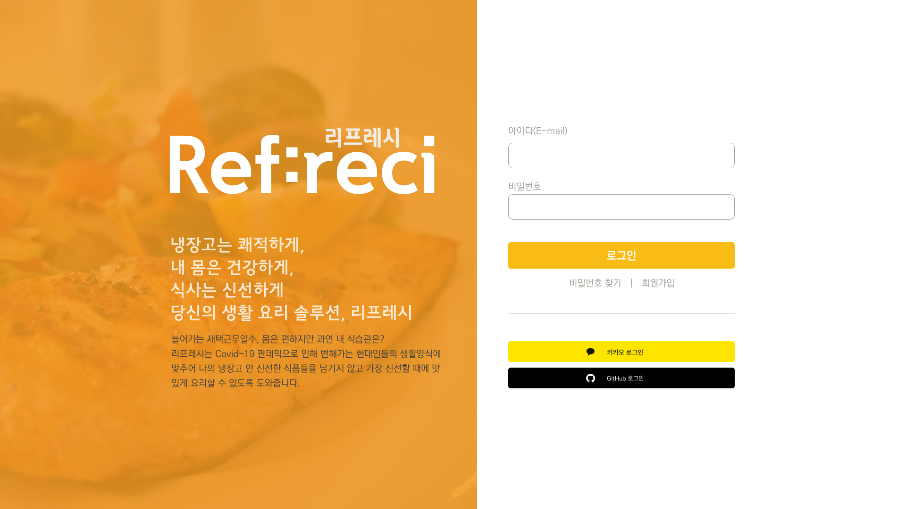

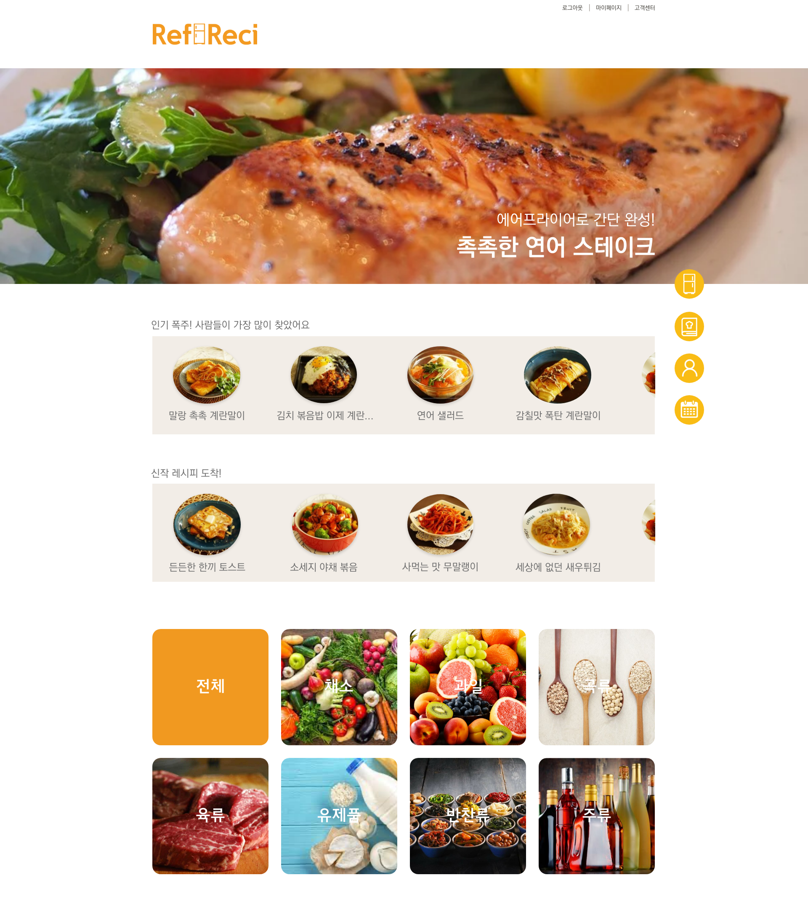

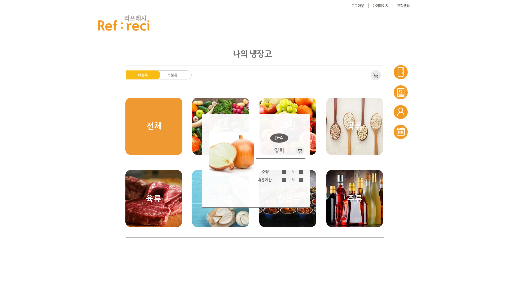

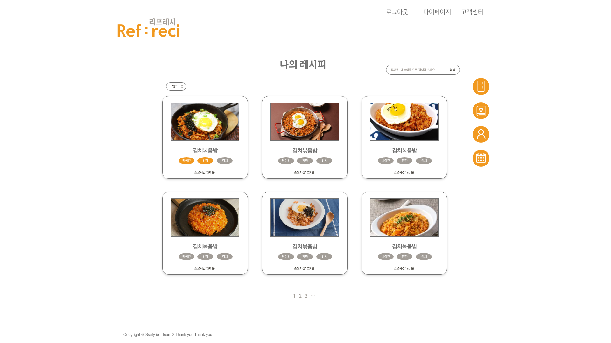

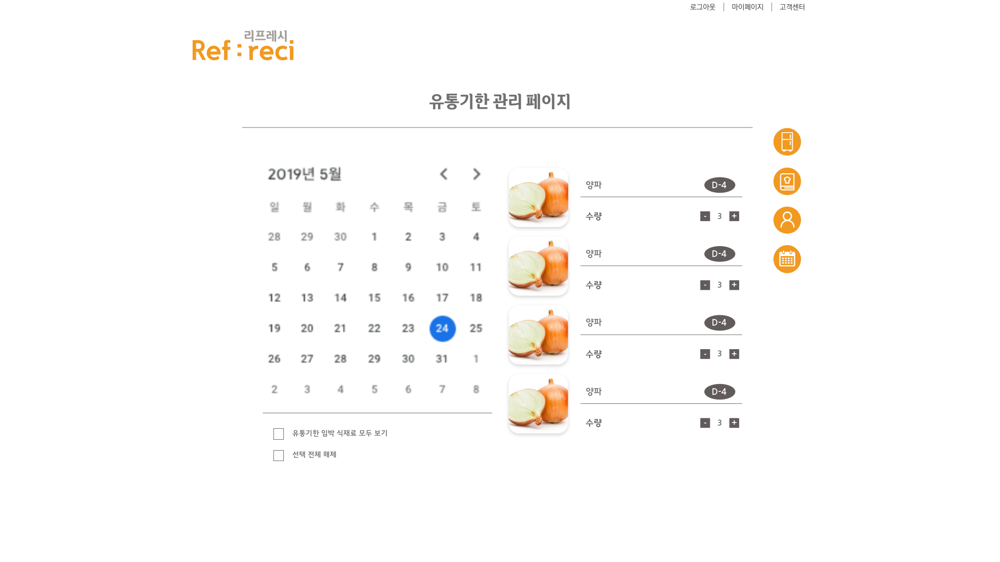

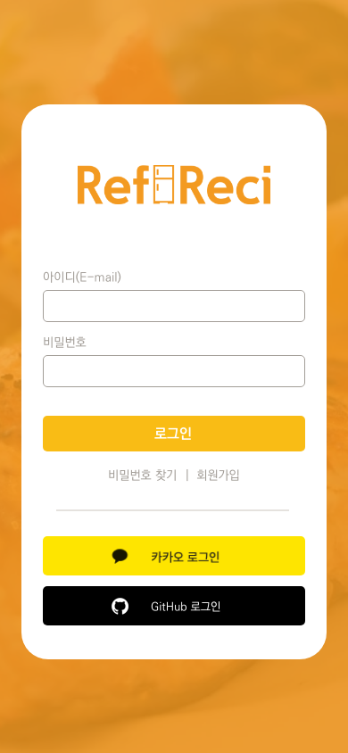


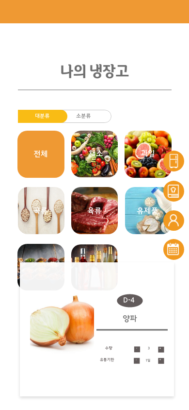


### 폴더 구조

```
/public
	favicon.io
	index.html
	manifest.json
	/images (Empty)

/src
	/common
	/componenents
		/Auth
			Signin  << 작업중
	/context
	/layout
	/pages
	App.js
	index.js
	index.css
	serviceworker.js
```


### 개발 Log

##### - 1주차 (2021-07-12 ~ 2021-07-16)

서비스 기획 및 컬러 세팅

흑백 레이아웃 목업 작성

담당자: 강지은, 박지우

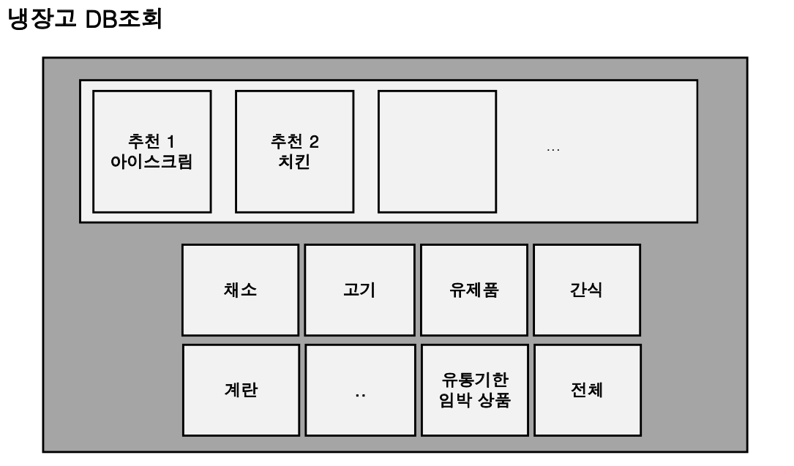 

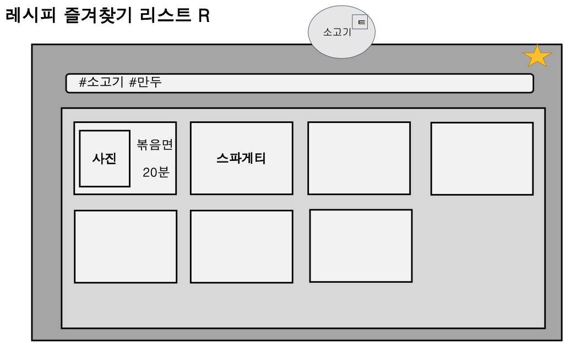

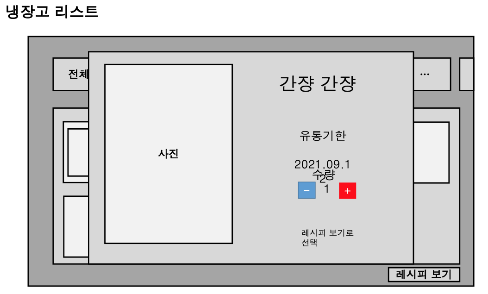


##### - 2주차 (2021-07-19 ~ 2021-07-23)

서비스 기획 수정 및 DB 일부 수정으로 인해 프론트 작업 다소 미뤄짐

수정사항 반영 기간 동안 로그인, 회원가입 React 코드 작성

담당자: 강지은, 박지우

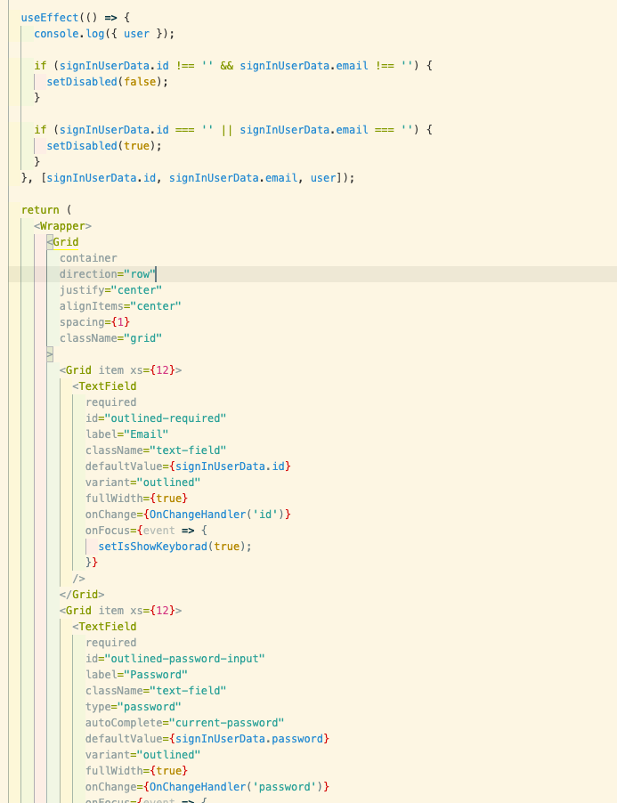


##### - 3주차 (2021-07-25 ~ 2021-07-30)

정확한 React 코드 작성 및 PPT 발표를 위해 상세 Wireframe & Design의 필요성 대두

상기 Wireframe 작성 및 PPT 제작

담당자: 박지우, 강리정


